<!-- Replace TU_USUARIO with your GitHub username throughout the file -->

  

<table>
<tr>
<td width="68%" valign="top">

### About me

Student of **Multiplatform Application Development (DAM)** in Barcelona. I build with Java, JavaScript and Kotlin, and what interests me most is what happens when code meets data: models, dashboards and, in the long run, **data analytics and machine learning applied to financial markets**.

| | |
|---|---|
| **Education** | Higher VET Diploma in Multiplatform App Development (CFGS DAM) |
| **Focus** | Software development and data analysis |
| **Goal** | Data Analytics / ML in fintech |
| **Languages** | Spanish, English, Catalan |
| **Location** | Barcelona, Spain |

</td>
<td width="32%" align="center" valign="middle">
  
</td>
</tr>
</table>

### Stack

**Languages**
 

**Data and tools**
 

**Currently learning**
 

### Right now

- In my second year of DAM: Kotlin, Jetpack Compose, Spring Boot, APIs with JDBC/JPA and MySQL
- Learning Python for data analysis
- Exploring electronics with Arduino

### Featured projects

| Project | What it is | Tech |
|---|---|---|
| [**Sales analysis**](https://github.com/TU_USUARIO/REPO) | Interactive dashboard with a star schema, a custom date table and DAX measures | Power BI, DAX |
| [**Interactive survey**](https://github.com/TU_USUARIO/REPO) | Survey with star ratings, local persistence and a protected results panel | HTML, CSS, JavaScript |
| [**NodeProject**](https://github.com/TU_USUARIO/REPO) | Backend project in Node.js | Node.js |
| [**LED keychain**](https://github.com/TU_USUARIO/REPO) | Heart-shaped keychain driven by shift registers | Arduino, electronics |

### Where I'm heading

My goal is to specialize in **data analytics and machine learning applied to financial markets**: price prediction, strategy backtesting and market data visualization. Every project I add here is a step in that direction.

### Contact

  

